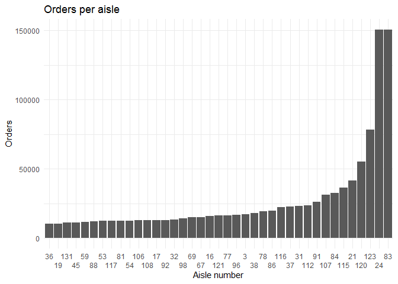

P8105: Homework 3
================
Alexander Melamed

``` r
library(tidyverse)
```

    ## -- Attaching packages --------------- tidyverse 1.3.0 --

    ## v ggplot2 3.3.2     v purrr   0.3.4
    ## v tibble  3.0.3     v dplyr   1.0.2
    ## v tidyr   1.1.2     v stringr 1.4.0
    ## v readr   1.3.1     v forcats 0.5.0

    ## -- Conflicts ------------------ tidyverse_conflicts() --
    ## x dplyr::filter() masks stats::filter()
    ## x dplyr::lag()    masks stats::lag()

## Problem 1

Load instacart data

``` r
library(p8105.datasets)
data("instacart")
```

**The goal is to do some exploration of this dataset. To that end, write
a short description of the dataset, noting the size and structure of the
data, describing some key variables, and giving illstrative examples of
observations. Then, do or answer the following (commenting on the
results of each):**

The dataset `instacart` includes the following variables: order\_id,
product\_id, add\_to\_cart\_order, reordered, user\_id, eval\_set,
order\_number, order\_dow, order\_hour\_of\_day,
days\_since\_prior\_order, product\_name, aisle\_id, department\_id,
aisle, department. This dataset has 1384617 rows and 15 columns. Each
row represents a single item in 131209 orders. The varaiblase `order_
_dow` and `order_hour_of_day` indicates the day and time the order was
placed.The variable `porduct_name` describes the item. The first three
items in this dataset are: Bulgarian Yogurt, Organic 4% Milk Fat Whole
Milk Cottage Cheese, Organic Celery Hearts.

**How many aisles are there, and which aisles are the most items ordered
from?**

There are n\_distinct 134 aisles, and the most items are ordered from
aisle 83.

**Make a plot that shows the number of items ordered in each aisle,
limiting this to aisles with more than 10000 items ordered. Arrange
aisles sensibly, and organize your plot so others can read it.**

To make a plot that shows the number of items ordered in each aisle,
limiting this to aisles with more than 10000 items ordered, I create a
datafrom consisting of aisles and number of orders

``` r
order_aisle = instacart %>% 
  group_by(aisle_id) %>% 
  summarise(n=n()) %>% 
  filter(n>10000) %>%
  arrange(n)%>%
  mutate(rank=rank(n))
```

Next I use ggplot to make a bar graph, with aisles arranged by
increasing order number. I use the guide\_axis option in
scale\_x\_discrete to make the x-axis legible and correspond to the
original aisle numbers.

``` r
ggplot(order_aisle, aes(x=factor(rank), y=n, )) +
  geom_bar(stat="identity")+
  theme_minimal()+
  labs(
    title = "Orders per aisle",
    x = "Aisle number",
    y = "Orders") +
  scale_x_discrete(
    labels=order_aisle$aisle_id,
    guide = guide_axis(n.dodge=2)
  )
```

<!-- -->

**Make a table showing the three most popular items in each of the
aisles “baking ingredients”, “dog food care”, and “packaged vegetables
fruits”. Include the number of times each item is ordered in your
table.**

``` r
  instacart %>% 
  filter(aisle=="baking ingredients" | aisle=="dog food care" | aisle=="packaged vegetables fruits") %>% 
  group_by(aisle) %>% 
  count(product_name) %>% 
  arrange(-n) %>% 
  mutate(item_rank=rank(-n)) %>% 
  filter(item_rank<4) %>% 
  knitr::kable(digits = 1)
```

| aisle                      | product\_name                                 |    n | item\_rank |
| :------------------------- | :-------------------------------------------- | ---: | ---------: |
| packaged vegetables fruits | Organic Baby Spinach                          | 9784 |          1 |
| packaged vegetables fruits | Organic Raspberries                           | 5546 |          2 |
| packaged vegetables fruits | Organic Blueberries                           | 4966 |          3 |
| baking ingredients         | Light Brown Sugar                             |  499 |          1 |
| baking ingredients         | Pure Baking Soda                              |  387 |          2 |
| baking ingredients         | Cane Sugar                                    |  336 |          3 |
| dog food care              | Snack Sticks Chicken & Rice Recipe Dog Treats |   30 |          1 |
| dog food care              | Organix Chicken & Brown Rice Recipe           |   28 |          2 |
| dog food care              | Small Dog Biscuits                            |   26 |          3 |

**Make a table showing the mean hour of the day at which Pink Lady
Apples and Coffee Ice Cream are ordered on each day of the week; format
this table for human readers (i.e. produce a 2 x 7 table).**

``` r
  instacart %>% 
  filter(product_name== "Pink Lady Apples" | product_name=="Coffee Ice Cream") %>% 
  group_by(product_name, order_dow ) %>% 
  summarise(mean_hour_of_day = mean(order_hour_of_day)) %>% 
  mutate(day_of_week=
           ifelse(order_dow==0, "Sunday",
            ifelse(order_dow==1, "Monday",
              ifelse(order_dow==2, "Tueday",
               ifelse(order_dow==3, "Wedday",
                ifelse(order_dow==4, "Thursday",
                 ifelse(order_dow==5, "Friday", "Saturday"))))))) %>% 
  select(day_of_week, mean_hour_of_day) %>% 
  pivot_wider(
    names_from = day_of_week,
    values_from = mean_hour_of_day) %>% 
  knitr::kable(digits = 1) 
```

    ## `summarise()` regrouping output by 'product_name' (override with `.groups` argument)

    ## Adding missing grouping variables: `product_name`

| product\_name    | Sunday | Monday | Tueday | Wedday | Thursday | Friday | Saturday |
| :--------------- | -----: | -----: | -----: | -----: | -------: | -----: | -------: |
| Coffee Ice Cream |   13.8 |   14.3 |   15.4 |   15.3 |     15.2 |   12.3 |     13.8 |
| Pink Lady Apples |   13.4 |   11.4 |   11.7 |   14.2 |     11.6 |   12.8 |     11.9 |

## Problem 2

**Load, tidy, and otherwise wrangle the data. Your final dataset should
include all originally observed variables and values; have useful
variable names; include a weekday vs weekend variable; and encode data
with reasonable variable classes. Describe the resulting dataset
(e.g. what variables exist, how many observations, etc).**

``` r
accel_data <- read_csv("data/accel_data.csv") %>%
  pivot_longer(
    activity.1:activity.1440,
    names_prefix="activity.",
    names_to="minute",
    values_to="activity_count"
  ) %>% 
  mutate(weekend=ifelse(day %in% c("Saturday", "Sunday"), TRUE, FALSE))
```

    ## Parsed with column specification:
    ## cols(
    ##   .default = col_double(),
    ##   day = col_character()
    ## )

    ## See spec(...) for full column specifications.

The data set `accel_data` The includes the following variables: week,
day\_id, day, minute, activity\_count, weekend. This dataset has 50400
rows and 6 columns.

**Traditional analyses of accelerometer data focus on the total activity
over the day. Using your tidied dataset, aggregate accross minutes to
create a total activity variable for each day, and create a table
showing these totals. Are any trends apparent?**
